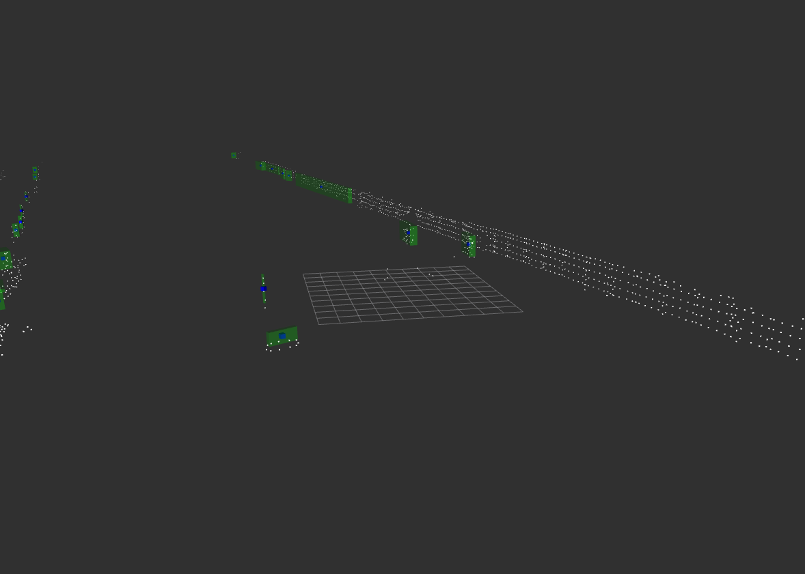

# aDDa Lidar Detection package
Adaptation of Autoware euclidian lidar detection package.



## How to run?
```  
rosbag play <name of rosbag file from kitti2bag>
roslaunch adda_lidar_detection lidar_detection.launch

```  

## How to configure the parameters?
The list of parameters can be found in the config/lidar_detection_config.yaml
The parameters are loaded into the node when its launched and they can be modified during execution using the rosparam command-line tool.

